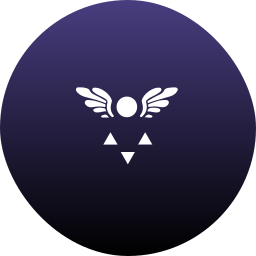

<div align="center">
    

<!-- omit in toc -->
# Straight Up Deltaruning It

<!-- omit in toc -->
###### *(not affiliated with DELTARUNE)*

</div>

A MuseScore plugin to help you arrange pieces for the DELTARUNE Ch.4 in-game piano.

- Showcase available here: <https://musescore.com/user/38096226/scores/27242308>
- This repository is dual-licensed; see below for details.

<!-- omit in toc -->
## Contents

- [Features](#features)
  - [Todo](#todo)
- [Usage](#usage)
- [Credits](#credits)
- [License](#license)

## Features

- [x] Notates the notes of the B major scale with arrows and cardinal directions
- [x] Creates a new "lyric" for each applied note
  - [ ] Customisable formatting; `⇐`, `$W`, `$6`, etc
- [x] Simple algorithm for determining efficiency in `●` vs `$N`
- [x] Detect repeated notes and replace them with `.`
  - [ ] Customisable behaviour for repeating notes; same, none, or special (`.`, etc)
- [ ] Place hyphens between "lyrics" for better automatic spacing

### Todo

- [ ] Remove unneeded/leftover code and reformat comments
- [ ] Implement customisation

## Usage

1. Place `./StraightUpDeltaruningIt.qml` and `./StraightUpDeltaruningIt.png` in your MuseScore `plugins` folder, conventionally in a subfolder named `straight-up-deltaruning-it`.
2. In MuseScore, refresh your plugins or restart the app. Ensure the plugin is enabled.
3. With your score open, select the notes you wish to apply the effect to, and activate the plugin. A lyric object will be created under each note.

After the plugin has been run, it may be necessary to manually check each instance of the equivalent notes `●` and `$N` to determine which is more efficient in each case. To change one to the other, simply copy-and-paste from another location.

It's recommended to only use this plugin within projects where the entire score should use this gimmick. Some behaviours are untested.

## Credits

This plugin was adapted from the [Note Names][notenames] plugin in the MuseScore repository. The following copyright statement/s contained therein:

```qml
//      Copyright (C) 2012 Werner Schweer
//      Copyright (C) 2013 - 2021 Joachim Schmitz
//      Copyright (C) 2014 Jörn Eichler
//      Copyright (C) 2020 Johan Temmerman
```

Logo is adapted from the [*Delta rune*][delta-rune]. Not owned by me.

## License

- This repository is licensed under the [BSD 3-Clause License](LICENSE).
- The plugin itself is licensed under the [GNU General Public License v2.0](LICENSE.gpl), conforming with that of the original [notenames] plugin.

This project is not affiliated with *DELTARUNE*.

[delta-rune]: <https://undertale.fandom.com/wiki/Delta_Rune?file=Delta_rune.svg>
[notenames]: <https://github.com/musescore/MuseScore/blob/edf6004ecee4d0de89ad0cb7a3f0103efa9d7c42/share/plugins/note_names/notenames.qml> "Note Names"
